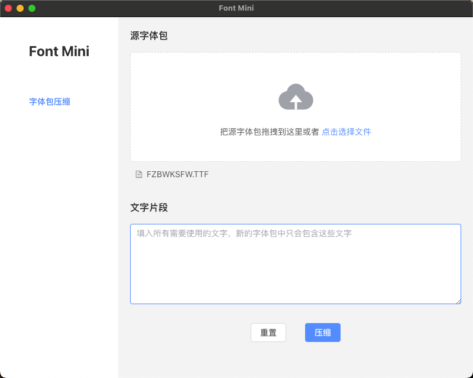

# Font Mini

Font Mini 客户端是基于 [fontmin](https://github.com/ecomfe/fontmin) 实现的一个压缩字体包的工具，免安装 解压即可使用。

[点击下载 Font Mini 客户端](https://github.com/night-peiqi/fontmini-app/releases)

# Screenshot



## Develop

```bash
# 拉取代码仓
git clone git@github.com:night-peiqi/fontmini-app.git

# 安装依赖
npm install

# 本地运行
npm run start

# 应用打包，会打包项目且生成可执行文件.exe
npm run package

# 制作安装包
npm run make
```

## Related

- [fontmin](https://github.com/ecomfe/fontmin)
